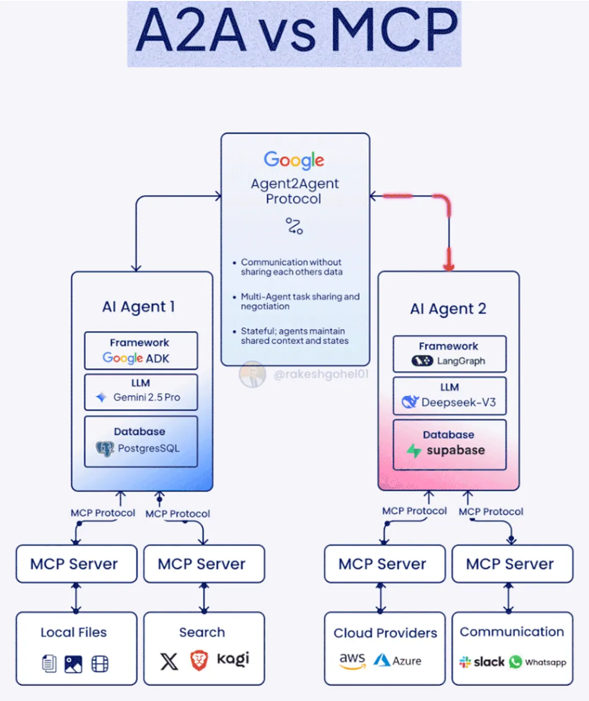

# A2A vs MCP Server Architecture

This repository demonstrates a multi-agent system using both the Agent2Agent (A2A) protocol and Model Context Protocol (MCP) servers for modular AI orchestration.

## Architecture Overview



### Key Components

- **Agent2Agent Protocol (A2A)**
  - Enables communication between AI agents without sharing raw data.
  - Supports multi-agent task sharing, negotiation, and stateful context management.
  - Example: Google Agent2Agent Protocol.

- **AI Agents**
  - Each agent is built on a framework (e.g., Google ADK, LangGraph) and uses an LLM (e.g., Gemini 2.5 Pro, Deepseek-V3).
  - Agents maintain their own databases (e.g., PostgreSQL, Supabase) for state and context.

- **MCP Servers**
  - Each agent exposes tools/services via MCP servers.
  - MCP servers provide modular access to:
    - Local files
    - Search (e.g., Kagi, DuckDuckGo)
    - Cloud providers (AWS, Azure)
    - Communication (Slack, WhatsApp)

### Example Flow

1. **Agent Discovery & Communication**
   - Agents discover each other using A2A protocol.
   - Tasks and context are shared without exposing raw data.

2. **Tool Invocation via MCP**
   - Agents invoke tools/services via MCP protocol.
   - Example: AI Agent 1 uses MCP server to search files or web; AI Agent 2 uses MCP server to interact with cloud providers or messaging platforms.

## How to Run

1. **Start MCP Servers**
   - Each MCP server runs as a separate process, exposing tools for its agent.
   - Example:
     ```bash
     python3 math_mcp_server.py
     python3 search_mcp_server.py
     python3 cloud_mcp_server.py
     python3 comms_mcp_server.py
     ```

2. **Start Agents**
   - Agents connect to their respective MCP servers and register with the A2A protocol.
   - Example:
     ```bash
     python3 math-agent.py
     python3 research-agent.py
     python3 orchestrator-agent/orchestrator.py
     ```

3. **Orchestrate Tasks**
   - Use the orchestrator agent to delegate tasks between agents and MCP servers.

## Features

- Modular agent design with clear separation of concerns.
- Secure, stateful multi-agent communication via A2A.
- Extensible toolset via MCP servers (add new tools easily).
- Example integrations: web search, cloud APIs, messaging platforms.

## References
- [Google Agent2Agent Protocol](https://ai.google.dev/docs/agent2agent)
- [LangGraph](https://langgraph.com/)
- [Kagi Search](https://kagi.com/)
- [DuckDuckGo Instant Answer API](https://duckduckgo.com/api)

---

*Architecture diagram by @rakeshgohel01*
