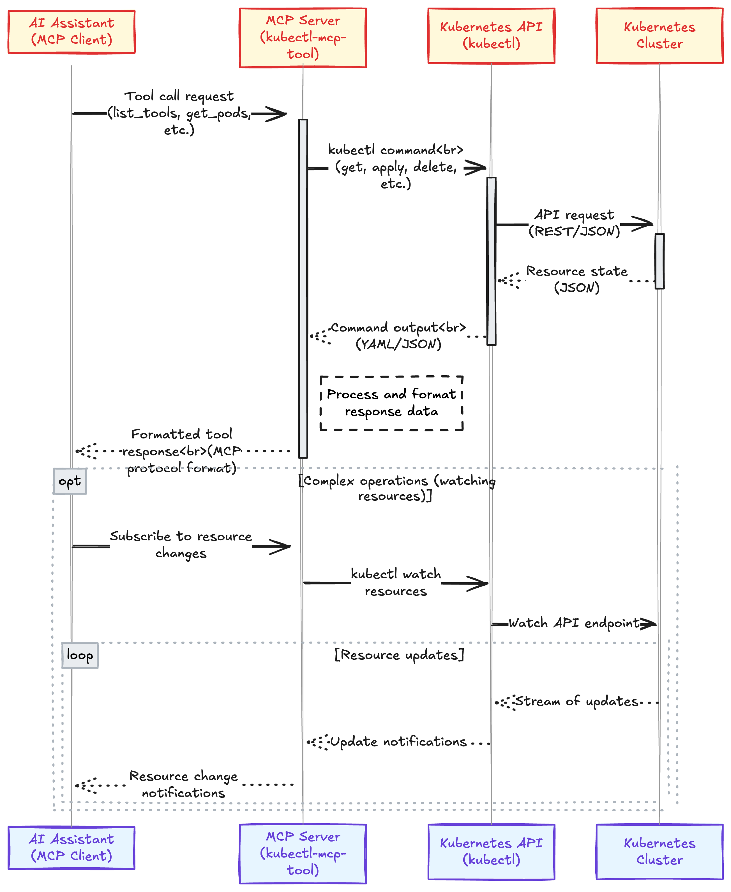

# Kubectl MCP Server

A Model Context Protocol (MCP) server for Kubernetes that enables AI assistants like Claude, Cursor, and others to interact with Kubernetes clusters through natural language.

[](https://opensource.org/licenses/MIT)
[](https://www.python.org/)
[](https://kubernetes.io/)
[](https://github.com/modelcontextprotocol/modelcontextprotocol)
[](https://pypi.org/project/kubectl-mcp-tool/)

## 🎥 Live Demo - Watch `kubectl-mcp-tool` in Action with Claude!


## 🎥 Live Demo - Watch `kubectl-mcp-tool` in Action with Cursor!


## 🎥 Live Demo - Watch `kubectl-mcp-tool` in Action with Windsurf!


## Features

### Core Kubernetes Operations
- [x] Connect to a Kubernetes cluster
- [x] List and manage pods, services, deployments, and nodes
- [x] Create, delete, and describe pods and other resources
- [x] Get pod logs and Kubernetes events
- [x] Support for Helm v3 operations (installation, upgrades, uninstallation)
- [x] kubectl explain and api-resources support
- [x] Choose namespace for next commands (memory persistence)
- [x] Port forward to pods
- [x] Scale deployments and statefulsets
- [x] Execute commands in containers
- [x] Manage ConfigMaps and Secrets
- [x] Rollback deployments to previous versions
- [x] Ingress and NetworkPolicy management
- [x] Context switching between clusters

### Natural Language Processing
- [x] Process natural language queries for kubectl operations
- [x] Context-aware commands with memory of previous operations
- [x] Human-friendly explanations of Kubernetes concepts
- [x] Intelligent command construction from intent
- [x] Fallback to kubectl when specialized tools aren't available
- [x] Mock data support for offline/testing scenarios
- [x] Namespace-aware query handling

### Monitoring
- [x] Cluster health monitoring
- [x] Resource utilization tracking
- [x] Pod status and health checks
- [x] Event monitoring and alerting
- [x] Node capacity and allocation analysis
- [x] Historical performance tracking
- [x] Resource usage statistics via kubectl top
- [x] Container readiness and liveness tracking

### Security
- [x] RBAC validation and verification
- [x] Security context auditing
- [x] Secure connections to Kubernetes API
- [x] Credentials management
- [x] Network policy assessment
- [x] Container security scanning
- [x] Security best practices enforcement
- [x] Role and ClusterRole management
- [x] ServiceAccount creation and binding
- [x] PodSecurityPolicy analysis
- [x] RBAC permissions auditing
- [x] Security context validation

### Diagnostics
- [x] Cluster diagnostics and troubleshooting
- [x] Configuration validation
- [x] Error analysis and recovery suggestions
- [x] Connection status monitoring
- [x] Log analysis and pattern detection
- [x] Resource constraint identification
- [x] Pod health check diagnostics
- [x] Common error pattern identification
- [x] Resource validation for misconfigurations
- [x] Detailed liveness and readiness probe validation

### Advanced Features
- [x] Multiple transport protocols support (stdio, SSE)
- [x] Integration with multiple AI assistants
- [x] Extensible tool framework
- [x] Custom resource definition support
- [x] Cross-namespace operations
- [x] Batch operations on multiple resources
- [x] Intelligent resource relationship mapping
- [x] Error explanation with recovery suggestions
- [x] Volume management and identification

## Architecture

### Model Context Protocol (MCP) Integration

The Kubectl MCP Tool implements the [Model Context Protocol (MCP)](https://github.com/modelcontextprotocol/spec), enabling AI assistants to interact with Kubernetes clusters through a standardized interface. The architecture consists of:

1. **MCP Server**: A compliant server that handles requests from MCP clients (AI assistants)
2. **Tools Registry**: Registers Kubernetes operations as MCP tools with schemas
3. **Transport Layer**: Supports stdio, SSE, and HTTP transport methods
4. **Core Operations**: Translates tool calls to Kubernetes API operations
5. **Response Formatter**: Converts Kubernetes responses to MCP-compliant responses

### Request Flow



### Dual Mode Operation

The tool operates in two modes:

1. **CLI Mode**: Direct command-line interface for executing Kubernetes operations
2. **Server Mode**: Running as an MCP server to handle requests from AI assistants

## Installation

For detailed installation instructions, please see the [Installation Guide](./docs/INSTALLATION.md).

You can install kubectl-mcp-tool directly from PyPI:

```bash
pip install kubectl-mcp-tool
```

For a specific version:

```bash
pip install kubectl-mcp-tool==1.1.1
```

The package is available on PyPI: [https://pypi.org/project/kubectl-mcp-tool/1.1.1/](https://pypi.org/project/kubectl-mcp-tool/1.1.1/)

### Prerequisites

- Python 3.9+
- kubectl CLI installed and configured
- Access to a Kubernetes cluster
- pip (Python package manager)

### Global Installation

```bash
# Install latest version from PyPI
pip install kubectl-mcp-tool

# Or install development version from GitHub
pip install git+https://github.com/rohitg00/kubectl-mcp-server.git
```

### Local Development Installation

```bash
# Clone the repository
git clone https://github.com/rohitg00/kubectl-mcp-server.git
cd kubectl-mcp-server

# Install in development mode
pip install -e .
```

### Verifying Installation

After installation, verify the tool is working correctly:

```bash
kubectl-mcp --help
```

Note: This tool is designed to work as an MCP server that AI assistants connect to, not as a direct kubectl replacement. The primary command available is `kubectl-mcp serve` which starts the MCP server.

## Docker Image

If you prefer using Docker, a pre-built image is available on Docker Hub:

```bash
# Pull the latest image
docker pull rohitghumare64/kubectl-mcp-server:latest
```

### Running the image

The server inside the container listens on port **8000**. Bind any free host port to 8000 and mount your kubeconfig:

```bash
# Replace 8081 with any free port on your host
# Mount your local ~/.kube directory for cluster credentials

docker run -p 8081:8000 \
           -v $HOME/.kube:/root/.kube \
           rohitghumare64/kubectl-mcp-server:latest
```

* `-p 8081:8000` maps host port 8081 → container port 8000.
* `-v $HOME/.kube:/root/.kube` mounts your kubeconfig so the server can reach the cluster.

### Building a multi-architecture image (AMD64 & ARM64)

If you want to build and push a multi-arch image (so it runs on both x86_64 and Apple Silicon), use Docker Buildx:

```bash
# Ensure Buildx and QEMU are installed once per machine
# docker buildx create --name multiarch --use
# docker buildx inspect --bootstrap

# Build and push for linux/amd64 and linux/arm64
# (replace <your_username> if you're publishing to your own registry)

docker buildx build \
  --platform linux/amd64,linux/arm64 \
  -t rohitghumare64/kubectl-mcp-server:latest \
  --push .
```

The published image will contain a manifest list with both architectures, and Docker will automatically pull the correct variant on each machine.

### Configuration

The MCP server is allowed to access these paths to read your Kubernetes configuration:

```yaml
run:
  volumes:
    - '{{kubectl-mcp-server.kubeconfig}}:/root/.kube'
config:
  description: The MCP server is allowed to access this path
  parameters:
    type: object
    properties:
      kubeconfig:
        type: string
        default:
          $HOME/.kube
    required:
      - kubeconfig
```

This configuration allows users to add their kubeconfig directory to the container, enabling the MCP server to authenticate with their Kubernetes cluster.

## Usage with AI Assistants

### Using the MCP Server

The MCP Server (`kubectl_mcp_tool.mcp_server`) is a robust implementation built on the FastMCP SDK that provides enhanced compatibility across different AI assistants:

> **Note**: If you encounter any errors with the MCP Server implementation, you can fall back to using the minimal wrapper by replacing `kubectl_mcp_tool.mcp_server` with `kubectl_mcp_tool.minimal_wrapper` in your configuration. The minimal wrapper provides basic capabilities with simpler implementation.

1. **Direct Configuration**
   ```json
   {
     "mcpServers": {
       "kubernetes": {
         "command": "python",
         "args": ["-m", "kubectl_mcp_tool.mcp_server"],
         "env": {
           "KUBECONFIG": "/path/to/your/.kube/config",
           "PATH": "/usr/local/bin:/usr/bin:/bin:/usr/sbin:/sbin",
           "MCP_LOG_FILE": "/path/to/logs/debug.log",
           "MCP_DEBUG": "1"
         }
       }
     }
   }
   ```

2. **Key Environment Variables**
   - `MCP_LOG_FILE`: Path to log file (recommended to avoid stdout pollution)
   - `MCP_DEBUG`: Set to "1" for verbose logging
   - `MCP_TEST_MOCK_MODE`: Set to "1" to use mock data instead of real cluster
   - `KUBECONFIG`: Path to your Kubernetes config file
   - `KUBECTL_MCP_LOG_LEVEL`: Set to "DEBUG", "INFO", "WARNING", or "ERROR"

3. **Testing the MCP Server**
   You can test if the server is working correctly with:
   ```bash
   python -m kubectl_mcp_tool.simple_ping
   ```
   This will attempt to connect to the server and execute a ping command.

   Alternatively, you can directly run the server with:
   ```bash
   python -m kubectl_mcp_tool
   ```

### Claude Desktop

Add the following to your Claude Desktop configuration at `~/Library/Application\ Support/Claude/claude_desktop_config.json` (Windows: `%APPDATA%\Claude\mcp.json`):

```json
{
  "mcpServers": {
    "kubernetes": {
      "command": "python",
      "args": ["-m", "kubectl_mcp_tool.mcp_server"], 
      "env": {
        "KUBECONFIG": "$HOME/.kube/config" // or whatever your path is for the config file
      }
    }
  }
}
```

### Cursor AI

Add the following to your Cursor AI settings under MCP by adding a new global MCP server:

```json
{
  "mcpServers": {
    "kubernetes": {
      "command": "python",
      "args": ["-m", "kubectl_mcp_tool.mcp_server"],
      "env": {
        "KUBECONFIG": "/path/to/your/.kube/config",
        "PATH": "/usr/local/bin:/usr/bin:/bin:/usr/sbin:/sbin:/opt/homebrew/bin"
      }
    }
  }
}
```

Save this configuration to `~/.cursor/mcp.json` for global settings.

> **Note**: Replace `/path/to/your/.kube/config` with the actual path to your kubeconfig file. On most systems, this is `~/.kube/config`.

### Windsurf

Add the following to your Windsurf configuration at `~/.config/windsurf/mcp.json` (Windows: `%APPDATA%\WindSurf\mcp.json`):

```json
{
  "mcpServers": {
    "kubernetes": {
      "command": "python",
      "args": ["-m", "kubectl_mcp_tool.mcp_server"],
      "env": {
        "KUBECONFIG": "/path/to/your/.kube/config"
      }
    }
  }
}
```

### Automatic Configuration

For automatic configuration of all supported AI assistants, run the provided installation script:

```bash
bash install.sh
```